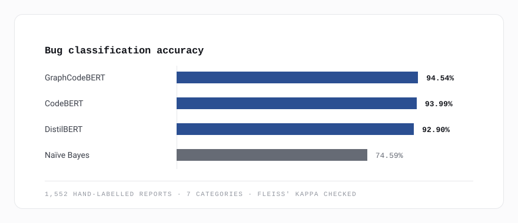
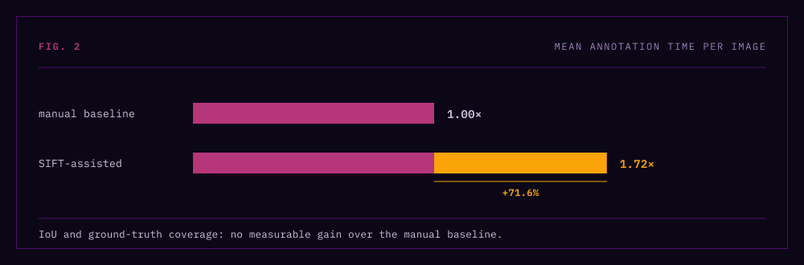
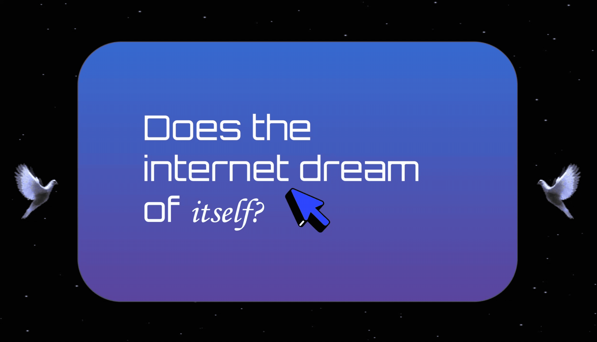
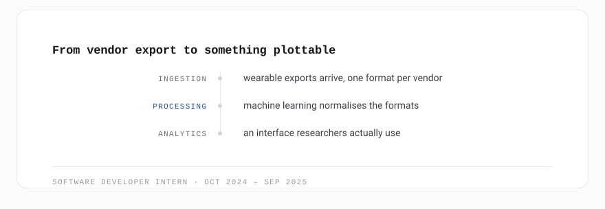
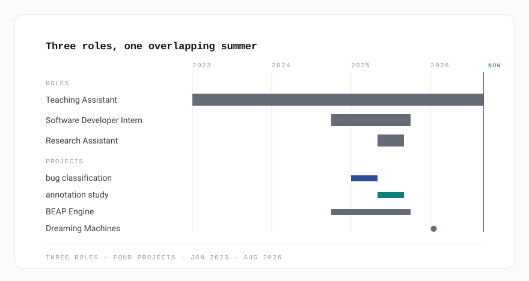
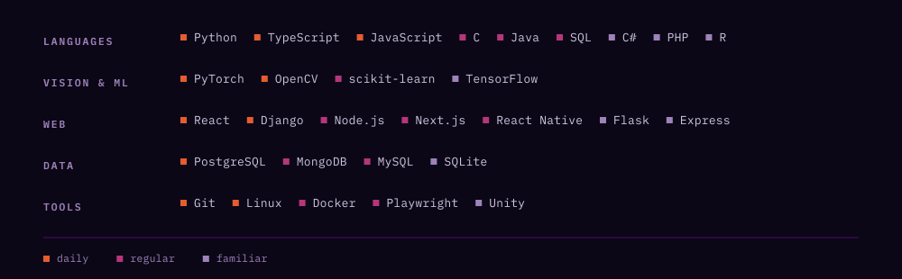

<picture>
  <source media="(max-width: 500px)" srcset="assets/masthead-narrow.svg">
  
</picture>

[See the work](#selected-projects) · [Get in touch](#lets-talk) · [Portfolio](https://ardalanaskarian.github.io) · [Résumé](https://ardalanaskarian.github.io/icons/resume.pdf)

## Turning research questions into working systems

Most of my work sits between a research question and the software that answers it: annotation platforms, data pipelines, and the interfaces researchers actually use. A good part of it is checking whether a thing works before claiming that it does.

I'm a Master's student specializing in Applied Machine Learning, researching computer vision and image processing under Dr. Mark Eramian. Before that, a B.Sc. Honours in Computer Science, Software Engineering option.

## Selected projects

Research first, then apps and games. Open any one for the detail.

### Fine-tuning LLMs for bug classification

Fine-tuned code transformers to sort GitHub bug reports into seven categories, benchmarked against classical ML on a hand-labelled corpus.

Read more

<picture>
  <source media="(max-width: 500px)" srcset="assets/bench-narrow.svg">
  
</picture>

Bars start at zero, where the twenty-point gap to the classical baseline is true. Truncating the axis would have separated the three transformers, but they finish within 1.64 points of each other, and that is a tie however it is drawn.

| | |
|:--|:--|
| **Built** | A labelling protocol, a scraper over the GitHub API, and one fine-tuning harness run across four models on one corpus |
| **Result** | GraphCodeBERT **94.54%** · CodeBERT 93.99% · DistilBERT 92.90% · Naïve Bayes 74.59% |
| **With** | Princess Tayab, Timofei Kabakov, Marmik Patel · January to April 2025 |
| **Stack** | Python · PyTorch · Transformers · CodeBERT · scikit-learn · GitHub API |

> Four people had to agree, 1,552 times, on whether a thing was a runtime bug or a logical one. That is what Fleiss' Kappa is measuring, and it is the part that never shows up in the accuracy column.

[Repo](https://github.com/ArdalanAskarian/LLM-Bug-Classification-Research) · [Full paper](https://drive.google.com/file/d/1-EZ82nrDkz-cz7pluI41sm9CC6QkuIQV/view?usp=sharing) · [Presentation](https://docs.google.com/presentation/d/1UArFkzsltQq3Azejfe2cvDD90rAO6j08/edit?usp=sharing)

### SIFT-assisted image annotation

An annotation platform built to answer one question honestly: does machine assistance make human annotators better, or just busier?

Read more

<picture>
  <source media="(max-width: 500px)" srcset="assets/study-narrow.svg">
  
</picture>

Deltas from the manual baseline rather than absolute times. Drawn this way a null result still has a length, so both quality metrics sit on the same scale as the cost — which is the whole comparison.

| | |
|:--|:--|
| **Built** | A Django platform that proposed SIFT-derived bounding boxes for a human to accept, adjust or reject, logging every interaction against a manual baseline |
| **Result** | Assistance cost **71.6%** more time and returned no measurable gain in IoU or ground-truth coverage · 6 participants · 36,407 logged events |
| **With** | Dr. Mark Eramian, Imaging &amp; AI Lab · NSERC USRA, May to August 2025 · co-authored research poster |
| **Stack** | Django · Python · SIFT · OpenCV · JavaScript |

> Reviewing a wrong proposal costs more than drawing a box from scratch, and confidence in a suggestion is not the same thing as its accuracy.

Private research. Details on request.

### Dreaming Machines

Biometric VR driven by a live pulse sensor.

Read more

<picture>
  <source media="(max-width: 500px)" srcset="assets/signal-narrow.svg">
  
</picture>

Every hop between a heartbeat and a shader parameter. One mark travels the chain and blooms where it lands; it loops at no particular rate, because no rate, latency or frame time was recorded. The diagram is the topology, not a measurement.

| | |
|:--|:--|
| **Built** | A Meta Quest experience, a phone companion app that feeds content in as dream artifacts, and the wire between a fingertip and a shader |
| **Result** | Live biometrics driving the environment in real time, demoed at MIT Reality Hack 2026 |
| **With** | Samantha Herle (design and PM), Sean Rove (tech art), Ben Branch (hardware) · Ardalan Askarian on software |
| **Stack** | Unity 6 · OpenXR · XR Toolkit · Node.js · WebSocket · Three.js · Arduino · C# |

[Repo](https://github.com/ArdalanAskarian/dream_hackers) · [Demo video](https://www.youtube.com/watch?v=NY5WnzpsTtc) · [Pitch deck](https://docs.google.com/presentation/d/1j2qTOKgDBow35dwZyvudL7hVXUyHlVYta0Yu95tXGPk/edit?usp=sharing)

### BEAP Engine

Smartwatch data ingestion and analytics.

Read more

<picture>
  <source media="(max-width: 500px)" srcset="assets/pipeline-narrow.svg">
  
</picture>

The three stages are the platform's own. The shapes are drawn rather than measured: this is internal research tooling and nothing about it is published.

| | |
|:--|:--|
| **Built** | Ingestion, processing and analytics for wearable sensor data, with the interface rebuilt in React and TypeScript |
| **Result** | Vendor exports that disagree on shape, parsed into one the analytics can read |
| **With** | BEAP Lab · Software Developer Intern, October 2024 to September 2025 |
| **Stack** | React · TypeScript · Python · Data processing |

Internal platform. No public repo.

### Also

| | |
|:--|:--|
| [Sports Scheduling App](https://github.com/ArdalanAskarian/Sports-Scheduler) | front end for a team-management app |
| [Weather App](https://github.com/ArdalanAskarian/Ardalan-Weather-App) | a native Swift client for live forecasts |
| [Dentistry Website](https://github.com/ArdalanAskarian/Dentist-Website) | booking flow and integrated maps |
| [Darkness Defenders](https://github.com/ArdalanAskarian/Darkness-Defenders) | a Unity tower defence with layered enemy AI |

[Browse every repo](https://github.com/ArdalanAskarian?tab=repositories)

## Where I've worked

<picture>
  <source media="(max-width: 500px)" srcset="assets/tenure-narrow.svg">
  
</picture>

Drawn to a month scale from the dates in the table below. The hackathon is a dot rather than a bar because it was a weekend, and a three-day bar would be a lie about its own width.

| | Role | |
|:--|:--|:--|
| Jan 2023 – present | **Teaching Assistant** | Department of Computer Science · six core courses, including CMPT 332 Operating Systems |
| May – Aug 2025 | **Research Assistant, NSERC USRA** | Imaging & AI Lab · the annotation study above |
| Oct 2024 – Sep 2025 | **Software Developer Intern** | BEAP Lab · BEAP Engine |

Two awards came out of the teaching side: the TESL Saskatchewan Bursary in 2022, one of two given province-wide, and the EAP Scholarship in 2020 as the highest achiever in English for Academic Purposes.

## Stack

<picture>
  <source media="(max-width: 500px)" srcset="assets/stack-narrow.svg">
  
</picture>

One dot per entry, in the column for how current it is. The figure answers how much of this is live; the table answers which ones, and that is the part a reader searches for.

|  | Daily | Regular | Familiar |
|:--|:--|:--|:--|
| **Languages** | Python, TypeScript, JavaScript | C, Java, SQL | C#, PHP, R |
| **Vision & ML** | PyTorch, OpenCV, SIFT | scikit-learn, Transformers, segmentation | TensorFlow |
| **Web** | React, Django | Node.js, Next.js, React Native, Express | Flask |
| **Data** | PostgreSQL | MongoDB, MySQL | SQLite |
| **Tools** | Git, Unix/Linux | Docker, Playwright | Unity |

Daily, in a project this term. Regular, several times a year. Familiar, used but not current.

## Activity

Three windows on the same habit, widest first. The snake is redrawn every twelve hours by <a href=".github/workflows/snake.yml">an Action in this repo</a>; the streak and the thirty-one-day graph come from third-party services, passed the same tokens as every figure above so they arrive in this page's palette rather than their own. None of the three measures anything except how often I pushed.

## Let's talk.

I'm looking for full-time software and machine learning roles, and I'm interested in research collaborations in computer vision. I answer every email.

[ardalan.askarian@usask.ca](mailto:ardalan.askarian@usask.ca) · [GitHub](https://github.com/ArdalanAskarian) · [LinkedIn](https://linkedin.com/in/ardalan-askarian-79221a24b) · [Portfolio](https://ardalanaskarian.github.io) · [Résumé](https://ardalanaskarian.github.io/icons/resume.pdf)

Saskatoon, SK. Figures are built by <a href="tools/build_svg.py">tools/build_svg.py</a> from the same tokens as <a href="https://ardalanaskarian.github.io">the portfolio</a>: system fonts, one neutral ramp, and colour reserved for links. The light set is served to every reader, so the page reads the same whichever theme you are in.
