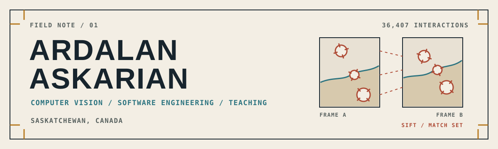
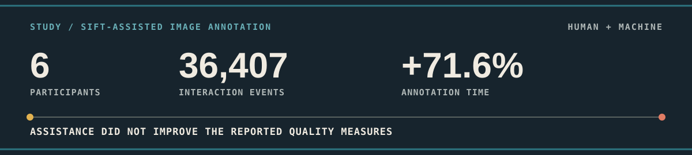
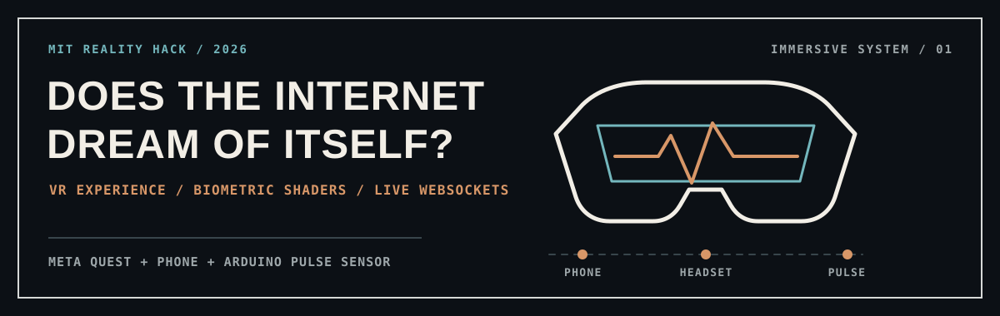

<picture>
  <source media="(prefers-color-scheme: dark)" srcset="./assets/header-dark.svg">
  <source media="(prefers-color-scheme: light)" srcset="./assets/header-light.svg">
  
</picture>

  <a href="https://ardalanaskarian.github.io">Portfolio</a>
  &nbsp;/&nbsp;
  <a href="https://linkedin.com/in/ardalan-askarian-79221a24b">LinkedIn</a>
  &nbsp;/&nbsp;
  <a href="mailto:ardalan.askarian@usask.ca">Email</a>
  &nbsp;/&nbsp;
  <a href="https://github.com/ArdalanAskarian">GitHub</a>

I build software around messy human signals: image annotations, smartwatch data, and a heartbeat inside VR.

I am an M.Sc. student in Computer Science at the University of Saskatchewan, specializing in Applied Machine Learning. My research sits at the intersection of computer vision, image processing, and the people who actually have to use intelligent tools. Away from the research questions, I like turning the same ideas into dependable full-stack systems and helping students make sense of computer science.

## 01 / Current frame

| Focus | In this frame |
|:--|:--|
| **Researching** | Computer vision and image processing with Dr. Mark Eramian |
| **Building** | Full-stack tools for computer vision and interaction-data studies |
| **Teaching** | Computer science at the University of Saskatchewan since 2023 |
| **Learning** | Advanced computer vision and deep learning architectures |
| **Based in** | Saskatchewan, Canada |
| **Pronouns** | he/him |

Ask me about computer vision, PyTorch, React, Django, teaching CS, or what 36,407 logged interactions can reveal about a tool.

## 02 / Research

### Enhancing Annotation Consistency and Efficiency

**A study of SIFT-assisted image annotation in computer vision** 
Ardalan Askarian and Dr. Mark Eramian

My work included developing a Django annotation platform that paired SIFT-generated boxes with human oversight, then comparing the assisted workflow with a manual baseline. Across six participants and 36,407 interaction events, assistance increased annotation time by 71.6 percent without improving the reported annotation quality measures.

The result is counterintuitive, which is exactly why I value it. Adding automation is not the same as improving a workflow. The study became a practical lesson in designing human-machine collaboration around evidence instead of novelty.

<strong>Study notes</strong>

| Aspect | Detail |
|:--|:--|
| Platform | Django-based image annotation system with SIFT proposals and human review |
| Comparison | Assisted annotation against a manual baseline |
| Data | 6 participants and 36,407 recorded interaction events |
| Finding | 71.6 percent more annotation time with no improvement in the reported quality measures |
| Output | Co-authored research poster on human-machine annotation workflows |
| Tools | Python, Django, OpenCV, SIFT, image segmentation |

## 03 / Selected work

### [Does the Internet Dream of Itself?](https://github.com/ArdalanAskarian/dream_hackers)

**Built at MIT Reality Hack 2026**

An immersive Meta Quest experience where players enter the internet's dream. A phone companion, an Arduino pulse sensor, and live WebSocket communication let the virtual world respond to the participant's heartbeat in real time. My work focused on the phone interface and Three.js previews, WebSocket setup, asset pipeline, and technical documentation. [Read the project story on Devpost](https://devpost.com/software/dream_hackers).

`Unity 6` `OpenXR` `Node.js` `Arduino` `Three.js` `WebSockets`

### BEAP Engine

**Smartwatch data platform / BEAP Lab**

Led full-stack development of a platform for large-scale smartwatch data processing and analytics. I redesigned the interface with React and TypeScript and implemented machine learning support for data parsing.

`React` `TypeScript` `Python` `Machine Learning`

### SIFT Annotation Platform

**Computer vision research system / Imaging and AI Lab**

Developed the research platform used to compare manual image annotation with SIFT-assisted workflows and capture detailed interaction data.

`Django` `Python` `OpenCV` `SIFT`

### Sports Scheduling App

**Team project / CMPT 370, Intermediate Software Engineering**

Led front-end development for a team sport management app using an Agile and Scrum workflow.

`React Native` `TypeScript` `PostgreSQL` `MongoDB`

## 04 / Experience

### Teaching Assistant

**University of Saskatchewan / Jan 2023 to present**

- Mentored more than 100 students across six computer science courses.
- Supported courses including Operating Systems.
- Gave detailed feedback on assignments and exams.

### NSERC USRA Researcher

**Imaging and AI Lab / May 2025 to Aug 2025**

- Researched SIFT-assisted image annotation.
- Conducted a six-participant user study and analyzed 36,407 events.
- Co-authored a research poster on human-machine collaboration.

### Software Developer Intern

**BEAP Lab / Oct 2024 to Sep 2025**

- Led full-stack development of BEAP Engine.
- Redesigned the interface with React and TypeScript.
- Implemented machine learning support for smartwatch data parsing.

## 05 / Education and recognition

### M.Sc. Computer Science

**University of Saskatchewan / Sep 2025 to present**

- Specialization: Applied Machine Learning
- Research: Computer Vision and Image Processing
- Supervisor: Dr. Mark Eramian

### B.Sc. Honours Computer Science

**University of Saskatchewan**

- Software Engineering Option
- 86 percent average
- Honours graduate

### Recognition

- **2025 / NSERC Undergraduate Student Research Award.** Supported computer vision research.
- **2022 / TESL Saskatchewan Bursary.** One of two recipients across the province.
- **2020 / EAP Scholarship.** $2,500 as the highest achiever in English for Academic Purposes.

## 06 / Working stack

My regular working set is **Python, TypeScript, React, PyTorch, Django, and OpenCV**. The broader toolkit comes from research, software work, teaching, and team projects.

| Area | Tools |
|:--|:--|
| Languages | Python, TypeScript, JavaScript, C, Java, SQL, PHP, C#, R |
| Web and mobile | React, React Native, Node.js, Next.js, Django, Flask, Express, HTML, CSS |
| Vision and ML | PyTorch, TensorFlow, OpenCV, scikit-learn |
| Data | PostgreSQL, MySQL, MongoDB, SQLite |
| Systems and tools | Git, Docker, Linux, Playwright, Unity, VS Code |

The questions I return to most often are how people work with computer vision systems, how applied ML fits into real software, and how interaction data can expose the gap between a promising idea and a useful tool.

<strong>GitHub activity</strong>

 

<picture>
  <source media="(prefers-color-scheme: dark)" srcset="https://raw.githubusercontent.com/ArdalanAskarian/ArdalanAskarian/output/github-snake-dark.svg">
  <source media="(prefers-color-scheme: light)" srcset="https://raw.githubusercontent.com/ArdalanAskarian/ArdalanAskarian/output/github-snake.svg">
  
</picture>

## 07 / Contact

I am always glad to talk about computer vision research, human-centered ML tools, teaching, or the difficult middle stretch between a prototype and dependable software.

- [ardalan.askarian@usask.ca](mailto:ardalan.askarian@usask.ca)
- [linkedin.com/in/ardalan-askarian-79221a24b](https://linkedin.com/in/ardalan-askarian-79221a24b)
- [ardalanaskarian.github.io](https://ardalanaskarian.github.io)
