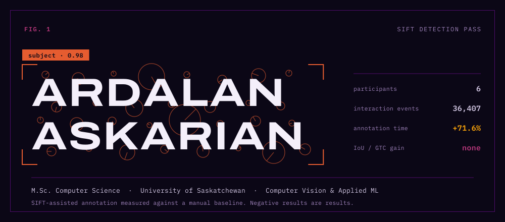

<picture>
  <source media="(prefers-color-scheme: dark)" srcset="assets/hero.svg">
  <source media="(prefers-color-scheme: light)" srcset="assets/hero-light.svg">
  
</picture>

  <a href="mailto:ardalan.askarian@usask.ca"><picture>
    <source media="(prefers-color-scheme: dark)" srcset="assets/link-email.svg">
    <source media="(prefers-color-scheme: light)" srcset="assets/link-email-light.svg">
    </picture></a>
  <a href="https://linkedin.com/in/ardalan-askarian-79221a24b"><picture>
    <source media="(prefers-color-scheme: dark)" srcset="assets/link-linkedin.svg">
    <source media="(prefers-color-scheme: light)" srcset="assets/link-linkedin-light.svg">
    </picture></a>
  <a href="https://ardalanaskarian.github.io"><picture>
    <source media="(prefers-color-scheme: dark)" srcset="assets/link-portfolio.svg">
    <source media="(prefers-color-scheme: light)" srcset="assets/link-portfolio-light.svg">
    </picture></a>
  <a href="https://github.com/ArdalanAskarian"><picture>
    <source media="(prefers-color-scheme: dark)" srcset="assets/link-github.svg">
    <source media="(prefers-color-scheme: light)" srcset="assets/link-github-light.svg">
    </picture></a>

## Now

I'm a M.Sc. Computer Science student at the **University of Saskatchewan**, in the Applied Machine Learning stream, supervised by **Dr. Mark Eramian**. My research is in computer vision and image processing — specifically annotation systems, and what happens to a person's workflow when a model starts making suggestions.

I've been a teaching assistant since January 2023, currently for **CMPT 332 (Operating Systems)**. Six courses, 100+ students, mostly spent writing feedback that explains *why* rather than just marking. Two awards came out of that side of the work: the TESL Saskatchewan Bursary in 2022, one of two given province-wide, and the EAP Scholarship in 2020 as the highest achiever in English for Academic Purposes.

Based in Saskatchewan, Canada.

| Years | Degree | |
|:--|:--|:--|
| 2025 – | **M.Sc. Computer Science** | University of Saskatchewan · Applied Machine Learning · computer vision & image processing |
| – 2025 | **B.Sc. Honours Computer Science** | University of Saskatchewan · Software Engineering option · 86% average |

## The study

**Enhancing Annotation Consistency and Efficiency: A Study of SIFT-Assisted Image Annotation in Computer Vision**
Ardalan Askarian and Dr. Mark Eramian · NSERC USRA, summer 2025 · co-authored research poster

<picture>
  <source media="(prefers-color-scheme: dark)" srcset="assets/study.svg">
  <source media="(prefers-color-scheme: light)" srcset="assets/study-light.svg">
  
</picture>

I built a Django annotation platform that proposed SIFT-derived bounding boxes for a human to accept, adjust, or reject, then measured it against a manual baseline. Six participants, 36,407 logged interaction events.

The assistance made annotation **71.6% slower** and produced no measurable improvement in IoU or ground-truth coverage. So the contribution isn't the tool — it's the account of *where* the time went: reviewing a wrong proposal costs more than drawing a box from scratch, and confidence in a suggestion is not the same as its accuracy. Those are the design lessons the poster reports for anyone building human-in-the-loop annotation systems.

Built with Django, Python, OpenCV, SIFT, and image segmentation.

## Work

### Does the Internet Dream of Itself?

**MIT Reality Hack 2026** · [dream_hackers](https://github.com/ArdalanAskarian/dream_hackers)

A VR experience for Meta Quest where you step inside the internet's dream. A companion phone app drives the environment, and an Arduino pulse sensor feeds the player's heartbeat into the shaders in real time over WebSockets, so the world reacts to how calm or agitated you actually are.

Unity 6 · OpenXR · Node.js · Arduino · Three.js

### BEAP Engine

**Software Developer Intern, BEAP Lab** · Oct 2024 – Sep 2025

Led full-stack development of a platform for processing and analysing smartwatch data at scale. Rebuilt the interface in React and TypeScript, and implemented the machine learning that parses inconsistent vendor export formats into something the analytics could actually use.

React · TypeScript · Python

### Sports Scheduling App

**CMPT 370, Intermediate Software Engineering**

Team sport management app — rosters, fixtures, and availability. I led front-end development across an Agile/Scrum term project.

React Native · TypeScript · PostgreSQL · MongoDB

## Stack

<picture>
  <source media="(prefers-color-scheme: dark)" srcset="assets/stack.svg">
  <source media="(prefers-color-scheme: light)" srcset="assets/stack-light.svg">
  
</picture>

<picture>
  <source media="(prefers-color-scheme: dark)" srcset="https://raw.githubusercontent.com/ArdalanAskarian/ArdalanAskarian/output/github-snake-dark.svg">
  <source media="(prefers-color-scheme: light)" srcset="https://raw.githubusercontent.com/ArdalanAskarian/ArdalanAskarian/output/github-snake.svg">
  
</picture>

&nbsp;

## Contact

I'm interested in research collaborations in computer vision, applied ML work, and open source.

- **Email** — [ardalan.askarian@usask.ca](mailto:ardalan.askarian@usask.ca)
- **LinkedIn** — [ardalan-askarian](https://linkedin.com/in/ardalan-askarian-79221a24b)
- **Portfolio** — [ardalanaskarian.github.io](https://ardalanaskarian.github.io)

Figures in this README are built from <a href="tools/build_svg.py">tools/build_svg.py</a> — set in Archivo Expanded and IBM Plex Mono, on a palette derived from the <code>magma</code> colormap.
